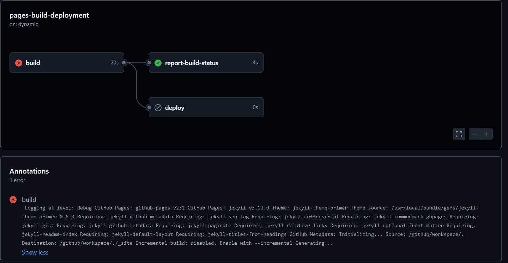

## Deploying to GitHub Pages
After I was somewhat satisfied with the website, the first order of business was to deploy it. I opted to use deploy it to GitHub Pages since:
- All the contents here are static
- It's free

I basically followed the steps detailed in Astro Docs about [deploying in GitHub Pages](https://docs.astro.build/en/guides/deploy/github/). I didn't use custom domain name (for now) because ... I didn't want to.
The nice thing is that the Astro Team has published all the necessary actions to install, build and upload the site [(link)](https://github.com/withastro/action/blob/main/action.yml). So, it was just a matter of calling the action in `.github/workflows/deploy.yml`.

When the workflows was ready, it was just a matter of pushing the changes to the main branch and viola, the blog was up and running.

## Ironing out the kinks
The website was up and running, I though my work was done for the day. But, I saw failure in the deployment status.

Why were there 2 actions running when I had only had one workflow specified? And why was the error trying to build a Jekyll page, when that hasn't even been used?

Looking around a bit I found that in `Build and Deployment` source was configured wrong in the setting.

It was set to `Deploy from a branch` on default, which was causing the extra action of trying to build Jekyll page. So, I just fixed it and that was the end of that.

## A bit of a tour of the `deployment.yml`
I wanted to see what was the inner logic of the `action.yml` script. Looking through the [yml file](https://github.com/withastro/action/blob/main/action.yml), it seemed pretty straightforward. The steps were basically:
- Find the package-manager by checking the what kind of lock file was present
- Setup the appropriate package manager in the environment
- Install the packages using `$PACKAGE_MANAGER install`
- Build the static site using `$PACKAGE_MANAGER run build` command
- Upload the pages the pages artifact using `actions/upload-pages-artifact@v3` actions

## In conclusion
All in all, this was a relatively straightforward process. Which seemed like a good starting point for a blog.
Yup, that's it I guess. Have a good one. Get out of here now.
